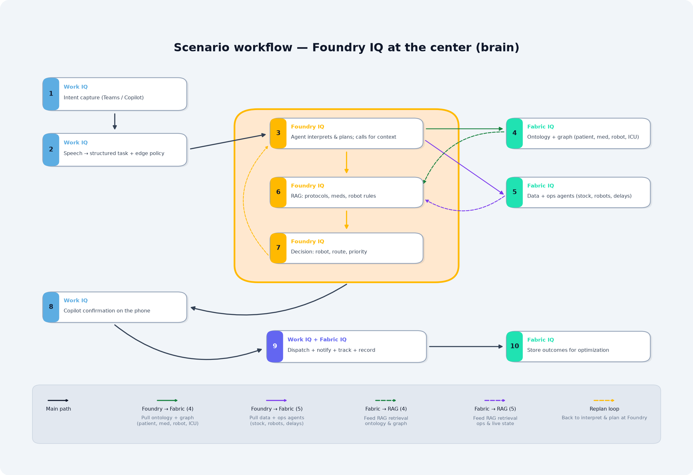
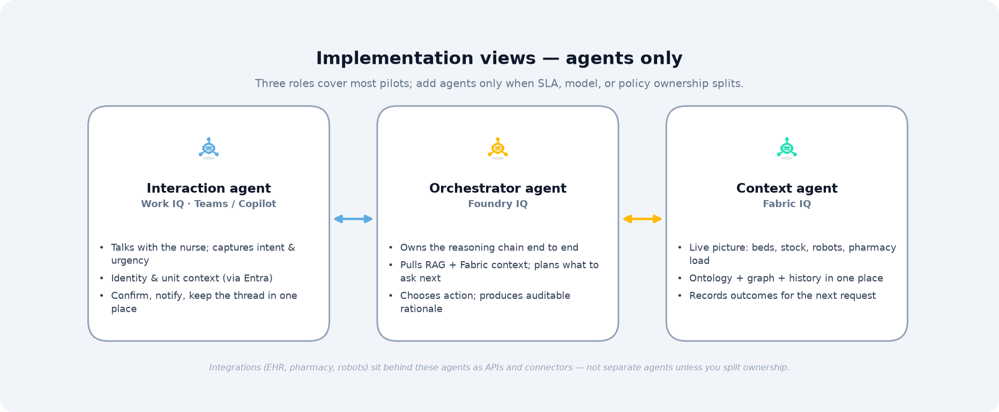

# Microsoft Vision (at least mine) — The IQ Era

---

## The problem Microsoft is solving

**Today’s enterprise reality**

- Data is fragmented (ERP, IoT, BI, apps…)
- AI exists but is stateless and generic
- Business context is missing

**Result**

- AI can generate, but it cannot **understand** or **operate** the business.

---

<h2 style="margin:0 0 0.55rem 0;font-size:1.25rem;font-weight:600;color:#ffffff;letter-spacing:-0.02em;">The system flow</h2>

Microsoft responds to <strong>fragmented data</strong> and <strong>stateless, generic AI</strong> by splitting responsibility across three layers—so the stack can <strong>understand</strong> the business, <strong>REASON</strong> with governance, and <strong>ACT (REACT)</strong> in the apps and workflows where people already work.

Fabric composes a <strong>unified live context</strong>; Foundry runs <strong>decision logic and trusted knowledge</strong> on top of it; Work IQ brings outcomes back through <strong>Copilot and the apps people already work in</strong> for confirmation and handoff.

<ol style="margin:0;padding-left:1.25em;color:#f1f5f9;line-height:1.65;font-size:0.98rem;list-style-position:outside;">
<li style="margin:0 0 0.35em 0;"><strong>Fabric IQ</strong> → understands (unified context)</li>
<li style="margin:0 0 0.35em 0;"><strong>Foundry IQ</strong> → reasons</li>
<li style="margin:0;"><strong>Work IQ</strong> → acts</li>
</ol>

---

## Example with a Use Case

In a hospital, a nurse needs a medication for a patient, but the dose is not available on the unit. In this hospital, getting it to the ICU is usually a robot task.

How to read this story

<ul style="margin:0;padding-left:1.2em;color:#f1f5f9;line-height:1.55;list-style-position:outside;">
<li style="margin:0 0 0.45em 0;">Follow one request from start to finish; each step shows which IQ layer is active and what that layer is responsible for there.</li>
<li style="margin:0 0 0.45em 0;margin-left:3em;list-style-type:none;">Work IQ — how people work (Copilot and everyday apps) <svg width="38" height="16" viewBox="0 0 38 16" xmlns="http://www.w3.org/2000/svg" aria-hidden="true" focusable="false"><circle cx="7" cy="8" r="3" fill="#334155" stroke="#5DADE2" stroke-width="1.2"/><path d="M13.5 8h17" stroke="#5DADE2" stroke-width="2.2" stroke-linecap="round"/><path d="M28 4.5l7.5 3.5-7.5 3.5" stroke="#5DADE2" stroke-width="2.2" fill="none" stroke-linecap="round" stroke-linejoin="round"/></svg> <strong>Interaction agent</strong></li>
<li style="margin:0 0 0.45em 0;margin-left:3em;list-style-type:none;">Foundry IQ — how the system decides (RAG, choices) <svg width="38" height="16" viewBox="0 0 38 16" xmlns="http://www.w3.org/2000/svg" aria-hidden="true" focusable="false"><circle cx="7" cy="8" r="3" fill="#334155" stroke="#FFB900" stroke-width="1.2"/><path d="M13.5 8h17" stroke="#FFB900" stroke-width="2.2" stroke-linecap="round"/><path d="M28 4.5l7.5 3.5-7.5 3.5" stroke="#FFB900" stroke-width="2.2" fill="none" stroke-linecap="round" stroke-linejoin="round"/></svg> <strong>Decision agent</strong></li>
<li style="margin:0 0 0.15em 0;margin-left:3em;list-style-type:none;">Fabric IQ — what the business <em>is</em> in data (live context, history, operations) <svg width="38" height="16" viewBox="0 0 38 16" xmlns="http://www.w3.org/2000/svg" aria-hidden="true" focusable="false"><circle cx="7" cy="8" r="3" fill="#334155" stroke="#20E2B2" stroke-width="1.2"/><path d="M13.5 8h17" stroke="#20E2B2" stroke-width="2.2" stroke-linecap="round"/><path d="M28 4.5l7.5 3.5-7.5 3.5" stroke="#20E2B2" stroke-width="2.2" fill="none" stroke-linecap="round" stroke-linejoin="round"/></svg> <strong>Data agent + operations agent</strong></li>
</ul>

### 1. She opens Teams and asks in natural language

- The nurse starts <strong>Copilot</strong> in Teams—for example: *“Bed 4 ICU north needs their stat antibiotic—we don’t have it on the floor. Can someone bring it from the secure pharmacy / central prep? I can’t leave.”*

<strong>Why Work IQ</strong>

<ul style="margin:0.35em 0 0 0;padding-left:1.5em;color:#475569;">
  <li><strong>Copilot</strong> = <strong>human interface</strong>: microphone, chat, <strong>identity</strong> (who she is, role, unit), urgency from how she asks</li>
  <li>Does not replace EHR or stock systems; <strong>captures intent</strong> and passes a structured request downstream</li>
  <li>Without Work IQ: more app-switching and retyped context</li>
</ul>

### 2. <strong>Copilot</strong> turns speech into a structured task

- Normalizes into entities: patient location, medication line, priority, action type (deliver / pick up / page)  
- Applies **policy at the edge** where needed (e.g., allowed to request that medication class on that unit)  

<strong>Why Work IQ</strong>

<ul style="margin:0.35em 0 0 0;padding-left:1.5em;color:#475569;">
  <li><strong>Interaction layer</strong>: guardrails the nurse sees, stays in one familiar app on a <strong>smartphone</strong></li>
  <li>She does not “open Foundry or Fabric”—<strong>Copilot</strong> invokes them next</li>
</ul>

### 3. A Foundry IQ <strong>agent</strong> takes ownership of the reasoning chain

- <strong>Agents</strong> as **decision-makers**: a <strong>decision agent</strong> receives the structured intent  
- Does not guess beds, stock, or robots; **plans**: missing facts, which queries, in what order  

<strong>Why Foundry IQ</strong>

<ul style="margin:0.35em 0 0 0;padding-left:1.5em;color:#475569;">
  <li><strong>Reasoning + orchestration</strong>: task interpretation, tool choice (Fabric context, policy <strong>RAG</strong>), path to a decision</li>
  <li>Articulates: what we know, what we still need, what is compliant next</li>
</ul>

### 4. Fabric IQ — ontology and graph

- <strong>Ontology</strong> — **defines meaning** for this hospital: what counts as “ICU north bed 4,” the med line, “pharmacy,” “delivery robot,” an active order, a SKU, etc.  
- <strong>Graph</strong> — **connects the business**: patient ↔ location ↔ order ↔ stock ↔ fleet (and related handoffs).  

### 5. Fabric IQ — data and operations agents

- <strong>Data agents</strong> answer: patient location now, SKU vs. active order, stock and where it sits  
- <strong>Operations agents</strong> add: charged robots, blocked corridors, pharmacy load / SLA pressure  

<strong>Why Fabric IQ</strong>

<ul style="margin:0.35em 0 0 0;padding-left:1.5em;color:#475569;">
  <li><strong>Ground truth</strong> for the business: real-time + historical, one place connecting bed, order, inventory, fleet</li>
  <li>Without it: a chatbot with no unified hospital state</li>
</ul>

### 6. Foundry IQ pulls in trusted knowledge (<strong>RAG</strong>)

- <strong>RAG</strong> injects **trusted knowledge**: retrieves **hospital protocols**, **medication rules** (windows, allergy checks via linked records), **robot SOPs** (Standard Operating Procedures)—from **curated** corpora, not the open web  

<strong>Why Foundry IQ</strong>

<ul style="margin:0.35em 0 0 0;padding-left:1.5em;color:#475569;">
  <li><strong>RAG</strong> ties answers to <strong>approved</strong> sources; robot/route/handoff stays under clinical and ops governance</li>
  <li>Fabric often <strong>hosts</strong> that content; Foundry <strong>uses</strong> it for this specific decision</li>
</ul>

### 7. Foundry IQ decides: best path under constraints

- Weights stock, distance, battery, corridors, protocol  
- Chooses **best robot**, **route**, **priority** (e.g., preempt lower-urgency work only if policy allows)  

<strong>Why Foundry IQ</strong>

<ul style="margin:0.35em 0 0 0;padding-left:1.5em;color:#475569;">
  <li><strong>Decision layer</strong>: optimization + compliance</li>
  <li>Outputs an <strong>auditable</strong> recommendation and rationale—not a blind “yes”</li>
</ul>

### 8. Work IQ brings the answer back to the nurse’s phone

- <strong>Copilot</strong> shows a short summary + confirm—for example: *“Robot B will bring the verified dose from central pharmacy to ICU north in about 3 minutes. Pharmacy has acknowledged. Confirm dispatch?”*  

<strong>Why Work IQ</strong>

<ul style="margin:0.35em 0 0 0;padding-left:1.5em;color:#475569;">
  <li><strong>Human-in-the-loop</strong> in the same Teams thread, readable on a small screen, one tap to confirm or change</li>
  <li>The nurse <strong>acts</strong> here; execution is not invisible automation</li>
</ul>

### 9. Execution: systems move; people stay informed

- On confirm: signals to robot control and pharmacy; **tracking** in Teams (status, ETA updates)  

<strong>Why Work IQ</strong>

<ul style="margin:0.35em 0 0 0;padding-left:1.5em;color:#475569;">
  <li><strong>Notifications</strong> and task flow where the nurse already works</li>
</ul>

<strong>Why Fabric IQ</strong>

<ul style="margin:0.35em 0 0 0;padding-left:1.5em;color:#475569;">
  <li><strong>Records</strong> the run: timestamps, actor, route, exceptions—for ops and compliance</li>
</ul>

### 10. Fabric IQ closes the learning loop

- After delivery: stores timing, delays, handoff success on the <strong>graph</strong> (unit, shift, med class, robot)  

<strong>Why Fabric IQ</strong>

<ul style="margin:0.35em 0 0 0;padding-left:1.5em;color:#475569;">
  <li><strong>Continuous improvement</strong>: richer history for the next stat request (e.g., routes that fail at handoff)</li>
  <li>Foundry can reuse that history; Work IQ can shorten prompts when patterns repeat</li>
</ul>

### Scenario steps (quick reference)

The workflow above is the **story** (what happens step by step). The diagram below is a **minimal implementation lens**: three named **agents** (icon + responsibilities each)—easy to scan next to the detailed scenario.

---

## The shift

<table style="width:100%;border-collapse:collapse;font-size:inherit;line-height:inherit;color:inherit;">
<thead>
<tr>
<th style="text-align:left;padding:0.5rem 0.75rem 0.55rem 0;border-bottom:2px solid rgba(255,255,255,0.28);font-weight:700;color:#ffffff;letter-spacing:0.02em;">From</th>
<th style="text-align:left;padding:0.5rem 0 0.55rem 0.75rem;border-bottom:2px solid rgba(255,255,255,0.28);font-weight:700;color:#ffffff;letter-spacing:0.02em;">To</th>
</tr>
</thead>
<tbody>
<tr>
<td style="vertical-align:top;padding:0.85rem 0.75rem 0.15rem 0;border-bottom:1px solid rgba(255,255,255,0.14);color:#f1f5f9;">Tools (Data + AI + Apps)</td>
<td style="vertical-align:top;padding:0.85rem 0 0.15rem 0.75rem;border-bottom:1px solid rgba(255,255,255,0.14);color:#f1f5f9;">A unified intelligent system that <strong style="color:#ffffff;font-weight:700;">reasons</strong> and <strong style="color:#ffffff;font-weight:700;">acts</strong>, on a live, unified view of the business</td>
</tr>
</tbody>
</table>

---

## The IQ system (three layers)

### 1. Fabric IQ — Understanding the business

**What it does**

- Unifies enterprise data
- Builds semantic models
- Adds <strong>ontology</strong> + <strong>graph</strong>
- Enables real-time + historical understanding
- Provides <strong>analytic</strong> + <strong>operational</strong> agents over the same unified business view

**Output**

- A shared business language

---

### 2. Foundry IQ — Reasoning & deciding

**What it does**

- Builds AI <strong>agents</strong>
- Connects to enterprise knowledge
- Uses <strong>RAG</strong> (Retrieval-Augmented Generation)

**Output**

- Context-aware intelligent decisions

---

### 3. Work IQ — Interacting & executing

**What it does**

- Embeds AI into daily workflows
- Understands meetings, chats, tasks
- Interfaces via <strong>Copilot</strong>

**Output**

- Natural human interaction with AI

---

## Where **agents** live (clarified)

| Layer | Agent type | Role |
|--------|------------|------|
| Work IQ | <strong>Interaction Agent</strong> | UX / <strong>Copilot</strong> |
| Foundry IQ | <strong>Decision Agent</strong> | Reasoning |
| Fabric IQ | <strong>Data Agent</strong> | Explain data |
| Fabric IQ | <strong>Operations Agent</strong> | Monitor & react |

---

### One-line takeaway

Microsoft IQ turns enterprise data into **shared understanding**, understanding into **intelligent decisions**, and decisions into **real-world actions**.
